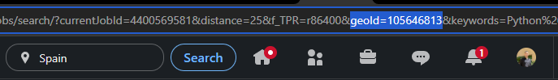
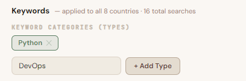
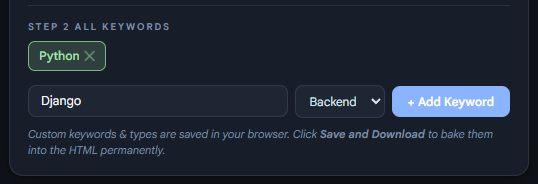
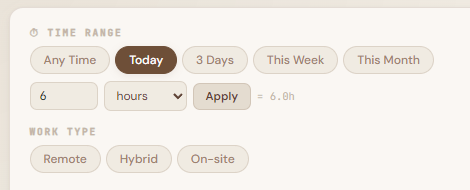
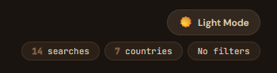
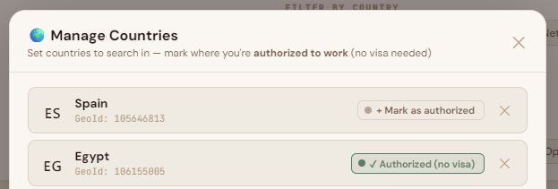
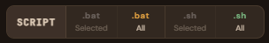
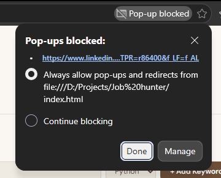

#  Job Hunter

**A single HTML file that turns your job search into a system.**

No backend. No sign-up. No subscriptions. Just drop it in your browser and start hunting.

Live at: **https://ramiadel.cloud/job-hunter/**

---

## What is this?

Job Hunter generates LinkedIn job search URLs for every combination of role and country you care about — and opens them all in one click. It's built for people who are actively searching and tired of manually setting the same filters over and over.

You have 5 job title keywords and 7 countries you're targeting? That's 35 LinkedIn searches. Job Hunter does all 35 in a few seconds, fully filtered to your preferences.

---

## Features

### 🔑 Keyword & Category System
Organize your target roles into categories — `Backend`, `Frontend`, `Data`, `DevOps`, or anything you come up with. Every keyword gets a color-coded badge that adapts to light and dark mode so you can scan at a glance.

### 🌍 Multi-Country Search with Authorization
Add any country by name, emoji flag, and LinkedIn GeoId. In **Manage Countries**, mark each country where you are **authorized to work** (home country, work permit, etc.). These are automatically excluded from Visa Mode — so you don't waste searches asking for visa sponsorship in your own country.

### ⏱ Smart Filters — All Persisted
- **Time Range** — Any Time, Today, 3 Days, This Week, This Month, or a custom value (e.g. "last 6 hours")
- **Work Type** — Remote, Hybrid, On-site (multi-select)
- **Easy Apply** — filter to jobs you can apply for without leaving LinkedIn
- **Visa Mode** — appends "visa sponsorship" to searches in countries where you're *not* authorized to work
- **Tab Speed** — throttle how fast new tabs open so your browser doesn't panic

All filter states are **fully persisted** — they survive page refreshes and are baked into saved files.

### 🌐 Visa Mode & Authorized Countries
Toggle **🌍 Visa Mode** to automatically append `"visa sponsorship"` to your searches. Open **Manage Countries** and click the **✓ Authorized** toggle next to any country where you already have the right to work — those countries will search normally, while the rest will include visa sponsorship.

> **Example:** You're Egyptian, searching in Germany and UK. Mark 🇪🇬 Egypt as Authorized. Enable Visa Mode. Egypt searches normally — Germany and UK search for visa-sponsored roles.

### 📋 Bulk Actions (Desktop)
- Open all visible searches at once, or a selected subset
- Card selection with Select All / Clear
- Grouped **Script Download** panel with 4 options:
  - **.bat Selected / All** — Windows batch script, opens URLs via terminal
  - **.sh Selected / All** — Linux/macOS shell script, auto-detects `open` (Mac) or `xdg-open` (Linux)

### 📱 Mobile-Friendly Design
- The fixed action bar is **hidden on mobile** — a clean "Save to File" panel appears instead
- Card selection and bulk "Open All" buttons are hidden on mobile (they'd just spam the LinkedIn app)
- A mobile notice appears automatically when the app detects a phone or tablet
- Individual **Open ↗** buttons on cards work perfectly as each opens the LinkedIn app directly

### 🌙 Dark Mode
Full dark mode support with a warm, readable color scheme. Toggle with the 🌙 button in the header. Category badge colors are vivid and readable in both modes and switch instantly without a page refresh.

### 🔔 Popup Permission Banner
On first visit (desktop), a guide banner explains how to allow pop-ups in your browser before you try to open tabs. This prevents confusion when the browser silently blocks them.

### 💾 Persistence That Makes Sense
Everything saves to `localStorage` automatically. Hit **Save to File** and it bakes your **complete setup** into a portable HTML file:
- All countries and authorization flags
- All keyword categories and keywords
- All active filters (time range, work type, easy apply, visa mode, tab speed)
- Dark mode preference

---

## Getting Started

### 1 — Download the file
Grab `index.html` from this repo, or open the live version at https://ramiadel.cloud/job-hunter/

### 2 — Open it in your browser
Double-click it. No server, no `npm install`, no nothing.

### 3 — Add your countries

Click **🌍 Manage Countries** in the filter panel. For each country you want to search in, you need:
- A flag emoji (e.g. `🇩🇪`)
- The country name
- Its LinkedIn GeoId

**Finding a GeoId:** Go to `linkedin.com/jobs/search/`, click the Location filter and type the country name, then look at the URL — you'll see `geoId=XXXXXXX`. Copy that number.

Common GeoIds are already listed in the modal for reference (US, UK, DE, FR, NL, CA, AU, SG, JP, SA, AE, ES, PL, PT, EG).

After adding countries, use the **✓ Authorized** toggle on each one to mark where you're authorized to work — this powers the Visa Mode exclusion logic.



### 4 — Add keyword categories

In the **Keywords** panel, go to *Step 1 — Keyword Categories*. Type a category name like `Backend` or `Data Science` and click **+ Add Type**. Add as many as you need. Categories are color-coded throughout the UI.



### 5 — Add your keywords

Type a job title in the keyword input, select its category from the dropdown, and click **+ Add Keyword**. These get combined with every country to generate search cards.

Examples: `Senior React Developer`, `Data Analyst`, `DevOps Engineer`, `Product Manager`



### 6 — Set your filters and open

Pick a time range, choose remote/hybrid/on-site, toggle Easy Apply or Visa Mode if needed — then hit **Open All ↗** or select specific cards and click **Open Selected**.



---

## New Features — Screenshots Needed

The following new features don't have screenshots yet. Add images to `Screenshots/` and update the paths below:

### Dark Mode
Toggle the 🌙 button in the header to switch between light and dark themes. Category badge colors adapt instantly.



### Visa Mode + Authorized Countries
In **Manage Countries**, the **✓ Authorized** toggle marks countries where you already have the right to work. When Visa Mode is enabled, those countries are excluded from the "visa sponsorship" append.



### Script Download Panel (.bat / .sh)
The action bar now includes a **Script** group with four options: `.bat Selected`, `.bat All`, `.sh Selected`, `.sh All`. The `.sh` option works on both Linux and macOS.




### Mobile Layout
On mobile, the action bar is replaced by a clean "Save to File" panel. Individual Open ↗ buttons on each card still work and open the LinkedIn app directly.

---

## Allowing Popups (Desktop)

When you open many tabs at once, browsers block them by default. A banner at the top of the page will guide you automatically. Here's the manual way:

### Chrome / Edge
1. Look for a popup blocked icon in the right side of the address bar
2. Click it → select **"Always allow popups from this site"**
3. Click **Open All** again



### Firefox
1. A bar appears at the top — click **Options** → **Allow popups for this page**

### Safari
1. Go to **Safari → Settings → Websites → Pop-up Windows**
2. Find the page and set it to **Allow**

### If popups are a pain: use a script file
Click the **Script** group in the action bar:
- **.bat (All)** — Windows: downloads a batch script that opens every URL one by one through your default browser
- **.sh (All)** — Linux/macOS: downloads a shell script. Run `chmod +x linkedin_search.sh` first, then `./linkedin_search.sh`

---

## Mobile Usage

On mobile, every link opens in the **LinkedIn app** directly — the browser can't open multiple tabs the way desktop can.

**Recommended mobile workflow:**
1. Tap **Open ↗** on individual search cards — each opens LinkedIn directly
2. Use the **Save to File** button to download a portable copy of your setup

The "Open All" bulk action is hidden on mobile to avoid accidentally launching dozens of LinkedIn app instances.

---

## Saving Your Setup

Your data saves to `localStorage` automatically, but that's tied to your browser and device. To make it truly portable:

1. Click **Save to File** (in the action bar on desktop, or the Actions panel on mobile)
2. A new `.html` file downloads with **everything** baked in — countries, keywords, categories, authorization flags, all active filters, dark mode preference
3. Open that file anywhere — different browser, different computer, share with a friend

The saved file is completely self-contained. No internet connection required to use it.

---

## Tips & Tricks

**Visa Mode + Authorized Countries** — Mark your home country (and any country with a work permit) as Authorized in Manage Countries. Then enable Visa Mode. Authorized countries search normally; the rest search for visa-sponsored roles. No manual exclusion lists needed.

**Filter by Country or Type** — use the pills in the filter panel to narrow what's visible without deleting anything. Useful when you want to focus on one region at a time.

**Custom time ranges** — the preset pills go up to "This Month", but you can type any number in the custom field. `6 hours`, `2 days`, `3 weeks` — all work. The value is saved and restored across sessions.

**Tab Speed slider** — if LinkedIn is rate-limiting you or tabs aren't loading, slow it down. 800–1200ms is a safe range.

**Editable title** — click the "Job Hunter" title or subtitle in the header to rename them. Useful for making separate files for different campaigns (e.g. "Europe Fintech Hunt 2025").

**Dark mode** — toggle with the 🌙 button. Color-coded category badges switch palette instantly — no refresh needed.

---

## How URLs are built

Every card generates a LinkedIn job search URL like this:

```
https://www.linkedin.com/jobs/search/?
  keywords=Senior+React+Developer+visa+sponsorship
  &geoId=101282230
  &distance=25
  &f_TPR=r604800
  &f_LF=f_AL
  &f_WT=2,3
```

Parameters used:
| Param | What it does |
|---|---|
| `keywords` | Your keyword (+ "visa sponsorship" if Visa Mode is on and country is not authorized) |
| `geoId` | The country's LinkedIn geographic ID |
| `distance` | Search radius in miles (fixed at 25) |
| `f_TPR` | Time posted range (e.g. `r604800` = last 7 days) |
| `f_LF` | `f_AL` = Easy Apply only |
| `f_WT` | Work type: `1`=On-site, `2`=Remote, `3`=Hybrid |

---

## File structure

It's one file. Everything — HTML, CSS, JavaScript, your saved data — lives in `index.html`. That's intentional. No build tools, no dependencies, no node_modules. Open and use.

---

## Browser support

Works in any modern browser: Chrome, Firefox, Edge, Safari, Arc.

- `.bat` script is **Windows only**
- `.sh` script is **Linux and macOS** (requires `bash`, uses `xdg-open` on Linux and `open` on macOS)
- Mobile: works on iOS and Android via individual card links (opens LinkedIn app)

---

## Contributing

Feel free to open issues or PRs. Areas for improvement:
- Support for more job platforms (Indeed, Glassdoor, etc.)
- Drag-to-reorder countries and keywords
- Export/import as JSON

---

## License

MIT. Do whatever you want with it.

---

*Shared to help serious job seekers. May Allah open the best doors for all of us.*